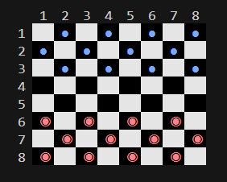
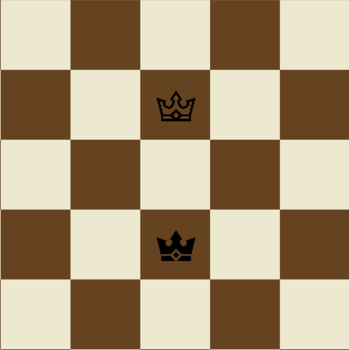
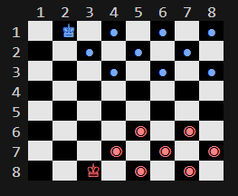

# CHECKERS GAME PROJECT (with Pygame GUI)


This repository contains the final version of a Checkers game developed in Python, using the Pygame library to create a complete and interactive graphical user interface (GUI).
The project also documents the development evolution, including the previous terminal-based versions, which can be found in the other (1.x) folders.

## Final Version (2.0) - Graphical Interface (GUI)

This is the main and most complete version of the project, located in the `(2.0)-versao_final_GUI/` folder.

### Features

* **Full Graphical Interface:** The board and pieces are rendered in an application window using Pygame.
* **Intuitive Controls:** Piece movement via mouse click (selecting the origin and destination).
* **Complete Ruleset Logic:**
    * Simple movement of pieces and kings.
    * **Forced Capture:** The player is forced to make a capture if one is available.
    * **Promotion to King:** Regular pieces are promoted to Kings upon reaching the opposite side, receiving a custom crown icon (from the `queen_black.png` and `queen_white.png` images).
    * **Draw Rule:** The game is declared a "Draw" if 40 consecutive moves occur without any capture.

## How to Run the Game (Version 2.0 GUI)

1.  **Clone the repository** to your computer.
2.  **Create a virtual environment** in the project's root folder:
    ```bash
    python -m venv .venv
    ```
3.  **Activate the virtual environment**:
    * On Windows (PowerShell):
        ```powershell
        .\.venv\Scripts\Activate.ps1
        ```
    * On macOS/Linux:
        ```bash
        source .venv/bin/activate
        ```
4.  **Install the required dependencies** (packages):
    ```bash
    pip install -r requirements.txt
    ```
5.  **Navigate to the GUI folder and run:**
    ```bash
    cd "(2.0)-final_version_GUI"
    python main_gui.py
    ```

---

## Project Evolution (Previous Terminal-based Versions)

This repository also contains the evolution of the game's logic. "<strong>Each (1.x) folder represents an independent and executable mini-project (via terminal)</strong>", showing the progression of the rules:



### 1. `(1.0)-game_base`
This is the "neutral" and initial version of the game. It contains:
* Simple movement of pieces and kings.
* Simple capture (but not mandatory).
* Promotion of pieces when they cross the board.
* Victory check by eliminating all opponent pieces.

### 2. `(1.2)-mandatory_capture`
This version adds the mandatory capture rule, one of the main mechanics of Checkers.
* The player is forced to make a capture if one is available.

### 3. `(1.3)-capture+draw`
This is the final version of the terminal logic, which adds the draw rule.
* The mandatory capture rule from Version 2 is maintained.
* The game is declared a "Draw" if 40 consecutive moves occur without any capture.

**To run these terminal versions:** After Step 4 (installing dependencies), navigate to the desired folder (e.g., `cd "(1.3)-capture+draw"`) and run `python ui.py`.

### Special Views: Kings

| GUI version (Pygame) | legacy versions (terminal) |
| :---: | :---: |
|  |  |

---

### Note on Repository Files

* `requirements.txt`: Lists the Python packages (pygame, termcolor) required to run all projects.
* `.gitignore`: A Git configuration file that instructs it to ignore local files and folders (like `.venv` and `__pycache__`), keeping the repository clean and functional for everyone who downloads it.git add .